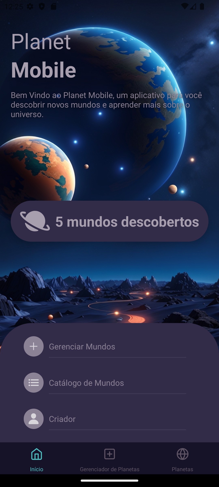
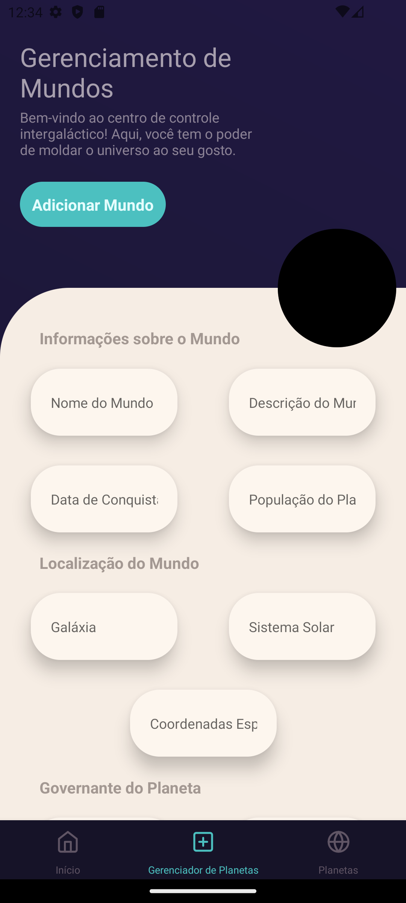
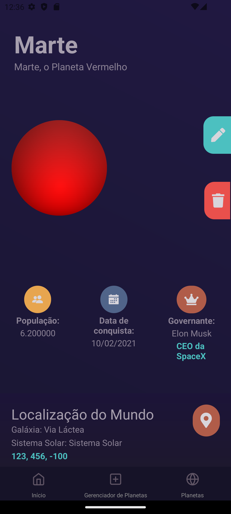
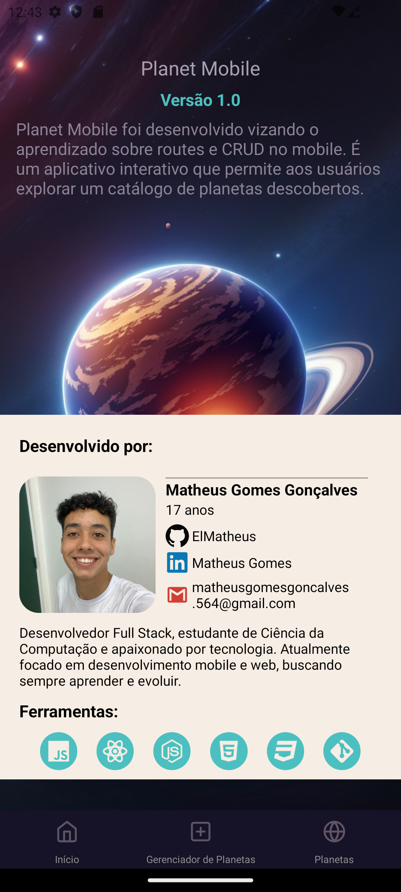

# Planet Mobile - Explore o Universo em Suas Mãos 🌌

# 📔 Visão Geral

Este aplicativo é um catálogo interativo de planetas. Ele permite que os usuários visualizem informações detalhadas sobre vários planetas descobertos.

# ℹ️ Como Funciona

O aplicativo permite que os usuários naveguem por um catálogo de planetas descobertos, visualizem detalhes sobre cada planeta e gerenciem os planetas no catálogo.

## Home

A tela Home é a primeira tela que os usuários veem ao abrir o aplicativo. Ela é composta por várias funcionalidades.

### Design

A imagem de fundo juntamente com o título e uma descrição, vem dando boas vindas ao aplicativo.

### Número de Mundos Descobertos

Este componente exibe o número total de mundos descobertos, que é obtido do repositório de planetas.

### Botões de Navegação

Existem três botões na tela Home que permitem aos usuários navegar para outras telas do aplicativo.

## Gerenciamento de Mundos

A tela de Gerenciamento de Mundos é onde os usuários podem interagir e personalizar seus próprios mundos. Ela é composta por várias seções:

### Fundo

O fundo da tela é um gradiente linear que vai do `#1a1733` para o `#201841`, criando um efeito visual agradável e atraente.

### Botões de Ação

Existem botões de ação que permitem aos usuários adicionar um novo mundo ou editar um mundo existente. Se o usuário estiver no modo de edição, um botão adicional aparecerá para permitir que eles cancelem a edição.

### Visualização do Mundo

Abaixo dos botões de ação, há uma visualização do mundo. Esta visualização mostra uma imagem de textura e um ícone de planeta com um gradiente de cores. As cores do gradiente podem ser personalizadas pelos usuários.

### Informações de Entrada

Finalmente, há uma seção de informações de entrada onde os usuários podem inserir detalhes sobre o mundo que estão criando ou editando. Esta seção contém vários campos de entrada para coletar informações do usuário.

## Planeta

A tela de Planeta é onde os usuários podem visualizar detalhes sobre um planeta específico. Ela é composta por várias seções:

### Informações do Planeta

Abaixo do cabeçalho, há uma seção de informações do planeta. Aqui, os usuários podem ver o nome do planeta e uma descrição detalhada do mesmo.

### Ícone do Planeta

Sobreposto à imagem do planeta, há um ícone de planeta. Este ícone é um gradiente de duas cores que podem ser personalizadas para cada planeta.

### Botões de Ação

Existem botões de ação que permitem aos usuários editar ou excluir o planeta atual.

## Planetas

Aqui você encontrará os catálogos de planetas descobertos

### Apresentação

Com todos os planetas existentes, nesta tela temos a imagem exemplo das cores do planeta, juntamente com o nome, descrição e habitantes deste planeta que ao clicar em cima leva para tela separada de cada planeta específico.

## Criador (Sobre Mim)

A tela Sobre Mim é onde os usuários podem aprender mais sobre o criador do aplicativo. Ela contém várias seções que fornecem informações sobre o desenvolvedor e o aplicativo.

### Informações do Aplicativo

Esta seção contém informações sobre o aplicativo, incluindo o título *Planet Mobile*, a versão do aplicativo e uma descrição do aplicativo, contendo uma imagem de fundo remetendo ao tema apresentado.

### Desenvolvedor

Esta seção contém informações sobre o desenvolvedor do aplicativo. Inclui uma imagem de perfil, o nome do desenvolvedor, a idade e links para o GitHub e LinkedIn do desenvolvedor.

# 📜 Nota

Se você encontrar algum bug no seletor de cores, tente navegar para outra tela e voltar. Isso geralmente resolve o problema.
